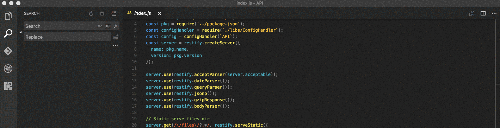
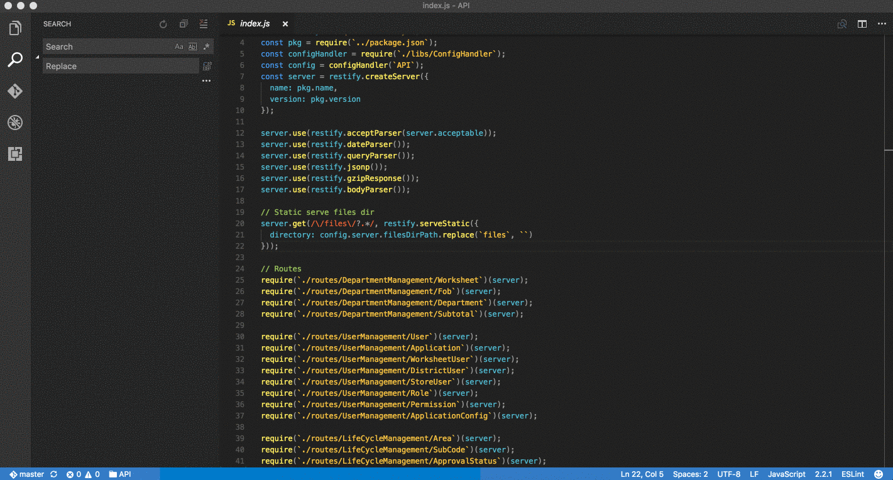

# VSCode-Terminal Project

setup your project's terminal commands and launch them through the VSCode integrated terminals.


## Installation

Press F1 in VSCode, type 
```
ext install vscode-terminal-project
```

## Usage
### Save Project
First you'll need to save a new project along with the scripts that you wish to run. 
> ``` Terminal Project: Save New Terminal Project ```



### Edit the list of project
To easily add more projects, edit, or re-cofigure a previously added project. you can edit the projects.json file yourself with the following command and the json file will open up ready for editiing.

For each command a separate terminal window is used.
> ``` Terminal Project: Edit Terminal Projects ```

```
[
	{
		"name": "vscode-terminal-launcher",
		"root_path": "/path/to/vscode-terminal-launcher",
		"commands": [
			{
				"name": "Run automated tests",
				"script": "npm run test-watch"
			},
			{
				"name": "transpile code with babel",
				"script": "npm run babel-dev"
			}
		]
	},
	{
		"name": "API",
		"root_path": "path/to/API",
		"commands": [
			{
				"name": "Application",
				"script": "npm run dev"
			},
			{
				"name": "transpile code",
				"script": "npm run babel-dev"
			}
		]
	}
]
```

### Run the terminal project
Once you're in the same directory of a project that you saved earlier, you can trigger the terminal extention with the following command
>```Terminal Project: Run Terminal Project```



## Extension Settings

This extension contributes the following settings:

* `	"terminalProject.projectsLocation"`: the path to the terminal-project.json file. 
leave it empty if you want to use the default
#### example:
`"terminalProject.projectsLocation: ""`

## Known Issues

The extension was only tested on macOS, some issues may arise on other Operating systems. 

Please feel free to file new issues and submit pull requests to resolve any issue you may have.

## Release Notes

please refer to the change log CHANGELOG.md

**Enjoy!**

## License

MIT © Yahya Gilany
