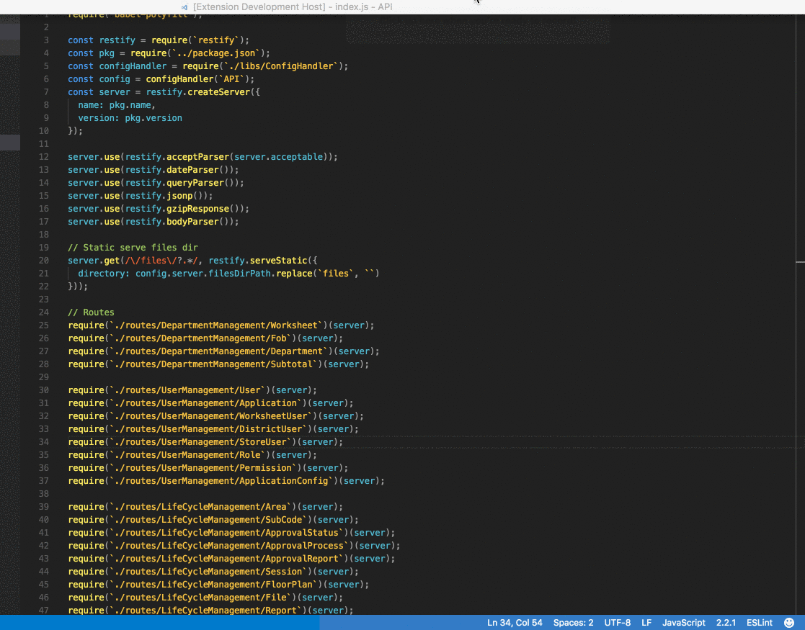

# VSCode-Terminal Project

setup your project's terminal commands and launch them through the VSCode integrated terminals.


## Installation

Press F1 in VSCode, type 
```
ext install vscode-terminal-project
```

## Usage


## Features

add new projects to the projects list and configure them with the termianl commands that you want to launch.




## Requirements

lodash is the only requirement for the extension

## Extension Settings

This extension contributes the following settings:

* `vscode-terminal-project.filePath`: the path to the terminal-project.json file. 
leave it empty if you want to use the default

## Known Issues

The extension was only tested on macOS, some issues may arise on other Operating systems. 

Please feel free to file new issues and submit pull requests to resolve any issue you may have.

## Release Notes

please refer to the change log CHANGELOG.md

**Enjoy!**

## License

MIT © Yahya Gilany
